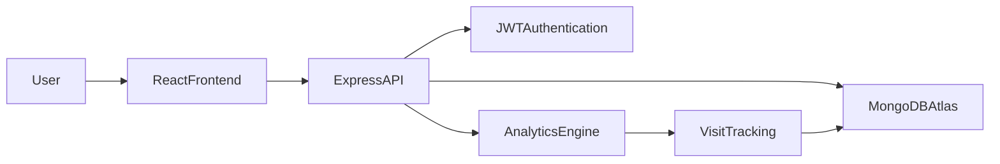
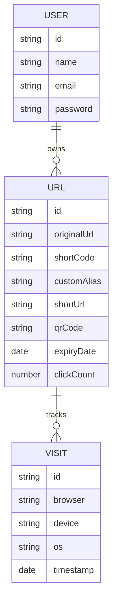

# 🔗 URL Shortener Pro – Smart Link Management Platform

## 🚀 Project Overview

URL Shortener Pro is a full-stack SaaS platform that enables users to create, manage, track, and analyze shortened URLs with enterprise-grade analytics. The platform provides secure authentication, QR code generation, custom aliases, click tracking, device analytics, browser insights, bulk URL shortening, and public statistics pages.

Built with a modern MERN architecture, the application focuses on performance, scalability, security, and an exceptional user experience.

---

## ✨ Features

### 🔐 Authentication & Security

* User Registration
* User Login
* JWT Authentication
* Protected Routes
* Password Hashing with bcrypt
* User-specific URL ownership
* Rate Limiting
* Helmet Security
* Input Validation
* CORS Protection

### 🔗 URL Management

* Create Short URLs
* Custom Alias Support
* Edit Destination URL
* Delete URLs
* Copy Short URL
* URL Validation
* Expiry Date Support

### 📊 Analytics Dashboard

* Total Click Tracking
* Last Visit Information
* Recent Visit History
* Daily Click Trends
* Browser Analytics
* Device Analytics
* Operating System Tracking
* Public Statistics Page

### 📱 Advanced Features

* QR Code Generation
* Bulk URL Shortening via CSV Upload
* Mobile Responsive Design
* Interactive Charts
* Professional Dashboard UI
* Real-Time Analytics

---

# 🏗 System Architecture



---

# 🗄 Database Architecture



---

# 🛠 Tech Stack

## Frontend

* React.js
* React Router
* Axios
* Tailwind CSS
* Recharts
* Lucide Icons
* React Hot Toast

## Backend

* Node.js
* Express.js
* JWT Authentication
* bcrypt
* Multer
* QRCode Generator
* CSV Parser

## Database

* MongoDB Atlas
* Mongoose ODM

---

# 📂 Project Structure

```text
URL-Shortener/
│
├── client/
│   ├── src/
│   │   ├── api/
│   │   ├── pages/
│   │   ├── routes/
│   │   ├── components/
│   │   ├── context/
│   │   ├── hooks/
│   │   └── assets/
│
├── server/
│   ├── src/
│   │   ├── config/
│   │   ├── controllers/
│   │   ├── middleware/
│   │   ├── models/
│   │   ├── routes/
│   │   ├── utils/
│   │   └── server.js
│
└── README.md
```

---

# ⚙️ Installation

## Clone Repository

```bash
git clone <repository-url>

cd URL-Shortener
```

---

## Backend Setup

```bash
cd server

npm install
```

Create `.env`

```env
PORT=5000

MONGO_URI=your_mongodb_connection_string

JWT_SECRET=your_secret_key

BASE_URL=http://localhost:5000
```

Run Backend

```bash
npm run dev
```

---

## Frontend Setup

```bash
cd client

npm install
```

Create `.env`

```env
VITE_API_URL=http://localhost:5000/api
```

Run Frontend

```bash
npm run dev
```

---

# 🔑 Environment Variables

## Backend

```env
PORT=
MONGO_URI=
JWT_SECRET=
BASE_URL=
```

## Frontend

```env
VITE_API_URL=
```

---

# 📡 API Documentation

## Authentication

### Register

```http
POST /api/auth/register
```

Request

```json
{
  "name":"John Doe",
  "email":"john@example.com",
  "password":"password123"
}
```

---

### Login

```http
POST /api/auth/login
```

Request

```json
{
  "email":"john@example.com",
  "password":"password123"
}
```

---

## URL Management

### Create Short URL

```http
POST /api/urls
```

Request

```json
{
  "originalUrl":"https://google.com",
  "customAlias":"google",
  "expiryDate":"2026-12-31"
}
```

---

### Get User URLs

```http
GET /api/urls
```

---

### Delete URL

```http
DELETE /api/urls/:id
```

---

### Bulk Upload

```http
POST /api/urls/bulk-upload
```

Upload CSV

```csv
originalUrl
https://google.com
https://github.com
https://openai.com
```

---

## Analytics

### URL Analytics

```http
GET /api/analytics/:id
```

### Daily Trends

```http
GET /api/analytics/trends/:id
```

---

# 📈 Key Analytics Captured

* Total Clicks
* Visit Timestamp
* Browser Information
* Device Information
* Operating System
* Daily Traffic Trends
* Recent Visit History

---

# 🔒 Security Features

* Password Hashing (bcrypt)
* JWT Authentication
* Route Protection
* Request Validation
* Helmet Middleware
* Rate Limiting
* CORS Configuration
* Secure Environment Variables

---

# 🚀 Deployment Guide

## Backend Deployment (Render)

1. Push backend to GitHub
2. Create Render Web Service
3. Connect GitHub Repository
4. Add Environment Variables
5. Deploy

## Frontend Deployment (Vercel)

1. Push frontend to GitHub
2. Import Project in Vercel
3. Configure Environment Variables
4. Deploy

## Database

Use MongoDB Atlas as the cloud database provider.

---

# 📸 Screenshots

Add screenshots here:

### Landing Page


### Dashboard


### Analytics


### Bulk Upload


### QR Code Generation


---

# 🎥 Loom Video

Demo Video:

```text
Add Loom Video Link Here
```

Example Sections:

* Project Walkthrough
* Authentication Flow
* URL Creation
* Analytics Dashboard
* Bulk Upload
* Deployment Demo

---

# 🧪 Assumptions

* Each user can access only their own URLs.
* Anonymous visitors can access shortened URLs.
* Analytics data is stored per URL.
* CSV uploads contain a valid `originalUrl` column.
* MongoDB Atlas is used for production deployment.

---

# 📈 Scalability Strategy

### For 1 Million+ Users

* Redis Caching Layer
* Horizontal Backend Scaling
* CDN Integration
* MongoDB Sharding
* Queue-based Analytics Processing
* Load Balancer
* Database Read Replicas

---

# 🔮 Future Enhancements

* Team Workspaces
* Role-Based Access Control
* AI-Powered Link Insights
* Geo-location Analytics
* Custom Domains
* Password-Protected Links
* Webhook Support
* API Key Management
* Link Scheduling
* Real-Time Analytics Dashboard
* Dark/Light Theme Toggle
* Progressive Web App (PWA)

---

# 👨‍💻 Author

Developed as a production-ready full-stack SaaS application demonstrating modern software engineering principles, scalable architecture, security best practices, and enterprise-grade analytics.

---

**This project is a part of a hackathon run by https://katomaran.com**
